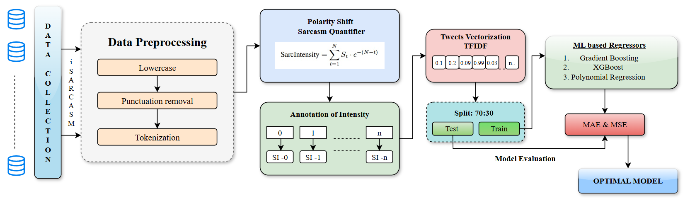

# Encryption Algorithm Classification using PCA and Machine Learning

## Description

This project focuses on the classification of encrypted data to identify the encryption algorithm used, such as **DES**, **AES**, **3DES**, and **Blowfish**, by analyzing the ciphertext. The project uses machine learning techniques in conjunction with **Principal Component Analysis (PCA)** for feature extraction and dimensionality reduction. The primary objective is to evaluate the classification model's performance with and without PCA. The results show how dimensionality reduction can enhance the model's accuracy and efficiency, allowing for better distinction between different cryptographic algorithms.

## Flow Diagram

## Procedure
  1. **Data Collection**:
    - The input data consists of Kannada language text that is encrypted using four cryptographic algorithms: DES, AES, 3DES, and Blowfish.
    - The encrypted data is used as the ciphertext for further analysis.

  2. **Feature Extraction**:
    - Byte frequencies and entropy are extracted from the encrypted data. These features are critical in identifying encryption algorithms, as different algorithms produce unique ciphertext characteristics.

  3. **Data Preprocessing**:
    - Data preprocessing involves cleaning the dataset, normalizing features, and preparing the data for machine learning models.
    - Outlier removal and handling missing data are also part of this step to ensure the quality of the dataset.

  4. **Dimensionality Reduction (PCA)**:
    - Principal Component Analysis (PCA) is applied to reduce the dimensionality of the data while retaining the most significant information.
    - PCA helps in filtering out noise, reducing computation time, and improving the model’s accuracy.

  5. **Model Training**:
    - Machine learning models such as Artificial Neural Networks (ANN) and traditional classifiers (e.g., Decision Trees, K-Nearest Neighbors) are used for training the data.
    - Models are trained both with and without PCA to compare the impact of dimensionality reduction on performance.
     
  6. **Model Evaluation**:
    - The models are evaluated based on various metrics, including accuracy, precision, recall, and F1-score.
    - This helps assess how well the model performs with and without PCA in classifying the encryption algorithms.

## Results

**Without PCA**:
- The model achieved an accuracy of 90%, but the classification performance varied across different algorithms, with precision and recall scores differing for AES, DES, 3DES, and Blowfish.
  
**With PCA**:
- By applying PCA, the model's performance improved significantly, achieving a 99% accuracy. The dimensionality reduction allowed the classifier to focus on the most important features, leading to better precision and recall scores, particularly for AES and Blowfish.
  
**Key Findings**:

- PCA significantly improved the classifier's ability to distinguish between encryption types, reducing noise and unnecessary features, which helped in achieving better accuracy and computational efficiency.
- The implementation of PCA not only enhanced the classification results but also optimized the model for faster processing.

## Dataset Links

The dataset used in this project can be accessed here:
- [Dataset 1: Kannada Documents](<[https://www.kaggle.com/datasets/prishasawhney/sentiment-analysis-evaluation-dataset](https://www.kaggle.com/datasets/rkasturirangan/kannada-documents-for-classification-kdc)>)
- Dataset 2: Encrypted Documents: It can be found above.

